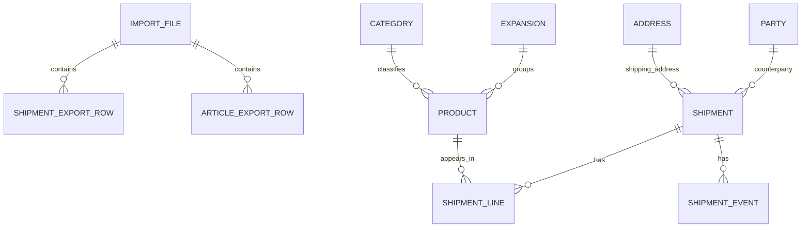

# Datenmodell fuer Cardmarket-Historie

Stand der Analyse: 2026-07-07

Analysierter Ordner: `D:\OneDrive\Dokumente\CM History`

## Datenbestand

- 447 Dateien insgesamt
- 442 alte Excel-Dateien (`.XLS`) und 5 CSV-Dateien
- Zeitraum laut Dateinamen: 2016-04-01 bis 2026-07-06
- 21.172 gelesene Datenzeilen ueber alle Exportdateien
- Exportdimensionen:
  - Richtung: `PURCHASED` oder `SOLD`
  - Ebene: `ARTICLES` oder `SHIPMENTS`
  - Datumsbasis: `PURCHASEDATE` oder `PAYMENTDATE`

Zeilensummen je Exporttyp:

| Exporttyp | Dateien | Datenzeilen |
|---|---:|---:|
| PURCHASED ARTICLES BYPAYMENTDATE | 59 | 3.657 |
| PURCHASED ARTICLES BYPURCHASEDATE | 56 | 3.593 |
| PURCHASED SHIPMENTS BYPAYMENTDATE | 59 | 3.657 |
| PURCHASED SHIPMENTS BYPURCHASEDATE | 58 | 3.657 |
| SOLD ARTICLES BYPAYMENTDATE | 54 | 1.641 |
| SOLD ARTICLES BYPURCHASEDATE | 56 | 1.685 |
| SOLD SHIPMENTS BYPAYMENTDATE | 54 | 1.641 |
| SOLD SHIPMENTS BYPURCHASEDATE | 51 | 1.641 |

Wichtig: Die Dateien nach Kaufdatum und Zahlungsdatum sind keine getrennten Geschaeftsobjekte, sondern unterschiedliche Sichten auf dieselben Bestellungen/Sendungen. Beim Import muessen Dubletten ueber `order_id` plus Produkt-/Zeileninformationen erkannt werden.

## Konzeptionelles Modell



## Zieltabelle: import_file

Speichert Herkunft und Exportkontext jeder Datei.

| Feld | Typ | Bedeutung |
|---|---|---|
| import_file_id | bigint, PK | Technischer Schluessel |
| file_name | text, unique | Originaldateiname |
| file_extension | text | `XLS` oder `CSV` |
| direction | enum | `PURCHASED`, `SOLD` |
| export_level | enum | `ARTICLES`, `SHIPMENTS` |
| date_basis | enum | `PURCHASEDATE`, `PAYMENTDATE` |
| period_start | date | Startdatum aus Dateiname |
| period_end | date | Enddatum aus Dateiname |
| loaded_at | timestamp | Importzeitpunkt |
| row_count | integer | Anzahl Datenzeilen |
| parse_status | enum | `ok`, `warning`, `error` |

## Zieltabelle: shipment

Eine Cardmarket-Bestellung bzw. Sendung. Sie ist der zentrale fachliche Kopf.

| Feld | Typ | Quelle |
|---|---|---|
| shipment_id | bigint, PK | Technisch |
| order_id | text, unique empfohlen | `OrderID` bzw. `Shipment nr.` |
| direction | enum | Dateiname |
| username | text | `Username` |
| counterparty_name | text | `Name` |
| is_professional | boolean | `Is Professional`, Wert `X` = true |
| vat_number | text | `VAT Number` |
| article_count | integer | `Article Count` |
| merchandise_value | decimal(12,2) | `Merchandise Value` |
| shipment_costs | decimal(12,2) | `Shipment Costs` |
| trustee_service_fee | decimal(12,2), nullable | Nur PURCHASED SHIPMENTS |
| commission | decimal(12,2), nullable | Nur SOLD SHIPMENTS |
| total_value | decimal(12,2) | `Total Value` |
| currency | char(3) | `Currency` |
| description | text | `Description` |

## Zieltabelle: shipment_event

Trennt Kauf- und Zahlungszeitpunkt sauber vom Exportfilter.

| Feld | Typ | Bedeutung |
|---|---|---|
| shipment_event_id | bigint, PK | Technisch |
| shipment_id | bigint, FK | Bezug auf `shipment` |
| event_type | enum | `purchase`, `payment` |
| event_at | timestamp | `Date of Purchase`, `Date of Payment`, `Date of purchase`, `Date of payment` |
| source_import_file_id | bigint, FK | Herkunftsdatei |

Eindeutigkeit: `(shipment_id, event_type)` sollte eindeutig sein, sofern keine widerspruechlichen Werte aus verschiedenen Exporten auftreten.

## Zieltabelle: shipment_line

Artikelpositionen innerhalb einer Sendung.

| Feld | Typ | Quelle |
|---|---|---|
| shipment_line_id | bigint, PK | Technisch |
| shipment_id | bigint, FK | `Shipment nr.` / `OrderID` |
| product_id | text, FK nullable | `Product ID` |
| article_name | text | `Article` |
| localized_product_name | text | `Localized Product Name` |
| expansion_name | text | `Expansion` |
| category_name | text | `Category` |
| amount | integer | `Amount` |
| article_value | decimal(12,2) | `Article Value` |
| total | decimal(12,2) | `Total` |
| currency | char(3) | `Currency` |
| comments | text | `Comments` |

Empfohlene Dublettenregel fuer Artikelzeilen: `(shipment_id, product_id, article_name, amount, article_value, total, comments)`. Falls dieselbe Karte mehrfach in derselben Sendung mit identischen Werten vorkommen kann, sollte zusaetzlich die Originalzeilennummer aus der Importdatei gespeichert werden.

## Zieltabelle: product

Produktstammdaten aus den Artikel- und Sendungsexporten.

| Feld | Typ | Quelle |
|---|---|---|
| product_id | text, PK | `Product ID` |
| article_name | text | `Article` oder aus `Description` ableitbar |
| localized_product_name | text | `Localized Product Name` |
| expansion_id | bigint, FK | Aus `Expansion` |
| category_id | bigint, FK | Aus `Category` |

Hinweis: `Product ID` ist in den Daten numerisch dargestellt, sollte aber als Text gespeichert werden, damit keine Format- oder Dezimalprobleme entstehen.

## Zieltabelle: expansion

| Feld | Typ | Bedeutung |
|---|---|---|
| expansion_id | bigint, PK | Technisch |
| expansion_name | text, unique | Set/Edition, z. B. `Eldritch Moon`, `Mega Evolution` |

## Zieltabelle: category

| Feld | Typ | Bedeutung |
|---|---|---|
| category_id | bigint, PK | Technisch |
| category_name | text, unique | z. B. `Magic Single`, `Pokemon Single`, `Magic Lot` |

## Zieltabelle: party

Gegenpartei aus den Sendungsexporten.

| Feld | Typ | Quelle |
|---|---|---|
| party_id | bigint, PK | Technisch |
| username | text | `Username` |
| name | text | `Name` |
| is_professional | boolean | `Is Professional` |
| vat_number | text | `VAT Number` |

Empfohlene Eindeutigkeit: zuerst `username`, optional mit `name` als Plausibilitaetscheck.

## Zieltabelle: address

Adressen stehen nur in den Sendungsexporten.

| Feld | Typ | Quelle |
|---|---|---|
| address_id | bigint, PK | Technisch |
| street | text | `Street` |
| city | text | `City` |
| country | text | `Country` |

Diese Daten koennen personenbezogen sein. Fuer Auswertungen reicht oft ein direkter Snapshot in `shipment`; eine normalisierte `address`-Tabelle lohnt sich nur bei wiederholter Gegenpartei-/Adressanalyse.

## Rohdaten-Tabellen

Fuer reproduzierbaren Import empfehle ich zwei Staging-Tabellen, die exakt die Exportzeilen halten:

### article_export_row

Spalten: `import_file_id`, `source_row_number`, `shipment_nr`, `date_value`, `date_basis`, `article`, `product_id`, `localized_product_name`, `expansion`, `category`, `amount`, `article_value`, `total`, `currency`, `comments`.

### shipment_export_row

Spalten: `import_file_id`, `source_row_number`, `order_id`, `username`, `name`, `street`, `city`, `country`, `is_professional`, `vat_number`, `date_value`, `date_basis`, `article_count`, `merchandise_value`, `shipment_costs`, `trustee_service_fee`, `commission`, `total_value`, `currency`, `description`, `product_id`, `localized_product_name`.

## Import- und Bereinigungsregeln

1. Dateiname parsen: `^(PURCHASED|SOLD) (ARTICLES|SHIPMENTS)-BY(PAYMENTDATE|PURCHASEDATE)-YYYY-MM-DD_YYYY-MM-DD`.
2. Dezimalzahlen normalisieren: sowohl `14.5` als auch `14,50` kommen vor.
3. Datumsformate normalisieren: Beispiele sind `21/04/2016 4:16`, `2016-04-21 08:49:40` und `18.06.2016 19:00:30`.
4. `OrderID` und `Shipment nr.` als dieselbe fachliche ID behandeln.
5. `Date of Purchase`/`Date of purchase` und `Date of Payment`/`Date of payment` in `shipment_event` ablegen.
6. `Trustee service fee` existiert bei gekauften Sendungen; `Commission` existiert bei verkauften Sendungen.
7. `Product ID` als Text importieren, auch wenn Excel sie als Zahl anzeigt.
8. CSV-Dateien sind nur fuer `SOLD ARTICLES BYPURCHASEDATE` 2026-01 bis 2026-05 vorhanden und ueberlappen mit XLS-Dateien. Sie sollten als alternative Quelle oder Kontrollimport behandelt werden, nicht blind addiert.

## Minimaler SQL-Entwurf

```sql
create table import_file (
  import_file_id bigint generated always as identity primary key,
  file_name text not null unique,
  file_extension text not null,
  direction text not null check (direction in ('PURCHASED', 'SOLD')),
  export_level text not null check (export_level in ('ARTICLES', 'SHIPMENTS')),
  date_basis text not null check (date_basis in ('PURCHASEDATE', 'PAYMENTDATE')),
  period_start date not null,
  period_end date not null,
  loaded_at timestamp not null default current_timestamp,
  row_count integer not null,
  parse_status text not null default 'ok'
);

create table shipment (
  shipment_id bigint generated always as identity primary key,
  order_id text not null,
  direction text not null check (direction in ('PURCHASED', 'SOLD')),
  username text,
  counterparty_name text,
  is_professional boolean,
  vat_number text,
  article_count integer,
  merchandise_value decimal(12,2),
  shipment_costs decimal(12,2),
  trustee_service_fee decimal(12,2),
  commission decimal(12,2),
  total_value decimal(12,2),
  currency char(3),
  description text,
  unique (order_id, direction)
);

create table shipment_event (
  shipment_event_id bigint generated always as identity primary key,
  shipment_id bigint not null references shipment(shipment_id),
  event_type text not null check (event_type in ('purchase', 'payment')),
  event_at timestamp not null,
  source_import_file_id bigint references import_file(import_file_id),
  unique (shipment_id, event_type)
);

create table expansion (
  expansion_id bigint generated always as identity primary key,
  expansion_name text not null unique
);

create table category (
  category_id bigint generated always as identity primary key,
  category_name text not null unique
);

create table product (
  product_id text primary key,
  article_name text,
  localized_product_name text,
  expansion_id bigint references expansion(expansion_id),
  category_id bigint references category(category_id)
);

create table shipment_line (
  shipment_line_id bigint generated always as identity primary key,
  shipment_id bigint not null references shipment(shipment_id),
  product_id text references product(product_id),
  article_name text not null,
  localized_product_name text,
  expansion_name text,
  category_name text,
  amount integer,
  article_value decimal(12,2),
  total decimal(12,2),
  currency char(3),
  comments text,
  source_import_file_id bigint references import_file(import_file_id),
  source_row_number integer
);
```
