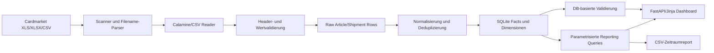

# Architektur

> **AI-/Best-Effort-Hinweis:** Projekt und Dokumentation wurden zu 100 % mit KI generiert.
> Keine Gewaehr; siehe [NOTICE.md](../NOTICE.md).

## Ziel und Randbedingungen

Das Projekt ist eine lokale Einzelplatzanwendung fuer Cardmarket-Exporthistorien. Die
kanonischen Eingaben sind XLS/XLSX/CSV-Dateien; SQLite ist ein reproduzierbarer, abgeleiteter
Arbeitsbestand. Es gibt keine Cardmarket-API, keine schreibende Web-API, keine Queue und keinen
externen Datendienst.

Leitentscheidungen:

- Server-renderte FastAPI/Jinja-Oberflaeche statt SPA
- SQLite statt separatem Datenbankserver
- Vollstaendige Rohzeilen-Nachvollziehbarkeit vor Normalisierung
- Idempotente, atomare Dateiimporte und expliziter Neuaufbau bei Algorithmus-/Quellaenderung
- Personenbezogene Felder standardmaessig maskieren bzw. gar nicht abfragen

## Komponenten

| Bereich | Ort | Verantwortung |
|---|---|---|
| Konfiguration | `src/cm_dashboard/config.py` | Projekt-, Quell- und DB-Pfade |
| Migration | `src/cm_dashboard/db.py`, `src/cm_dashboard/migrations` | Connection-Setup und geordnete Schemaaenderungen |
| Quellscan | `importing/source_scan.py`, `filename.py` | Dateierkennung und fachliche Metadaten |
| Lesen/Schema | `readers.py`, `schemas.py` | XLS/XLSX/CSV lesen und Headerfamilien pruefen |
| Raw Staging | `raw_store.py`, `shipment_grouping.py` | Unveraenderte Werte und Shipment-Fortsetzungen |
| Normalisierung | `article_import.py`, `shipment_import.py`, `normalize.py` | Dimensionen, Fakten, Events und Links |
| Orchestrierung | `pipeline.py`, `cli.py` | Savepoints, Hash-Idempotenz, Batch und atomarer Neuaufbau |
| Datenqualitaet | `validation.py` | Coverage-, Verknuepfungs- und Reconciliation-Pruefungen |
| Reporting | `reporting/queries.py` | Filter, Aggregationen, Pagination und Details |
| Web | `web/app.py`, Templates, Static | Read-only Browseroberflaeche und CSV-Antwort |

## Datenidentitaet

- Eine Sendung ist fachlich durch `direction + order_id` identifiziert.
- Kauf- und Zahlungsdatum sind Events derselben Sendung.
- Artikelzeilen behalten `direction`, `order_id`, `date_basis`, Quelle und Zeilennummer.
- Der Artikel-Business-Key normalisiert numerische Darstellungen und enthaelt einen
  Vorkommensindex. Dadurch werden CSV/XLS-Spiegel dedupliziert, echte identische Positionen
  innerhalb einer Datei aber erhalten.
- Produkte sind ueber `product_id` stabil; Namen, Set und Kategorie bleiben Snapshots, weil
  Bezeichnungen sich zwischen Exporten aendern koennen.

Die ausfuehrliche Feld- und Relationsbeschreibung steht in `Datenmodell.md`.

## Importtransaktionen

Ein inkrementeller Ordnerlauf arbeitet pro Datei mit einem SQLite-Savepoint:

1. Datei-Hash und vorhandenen Importstatus pruefen.
2. Quelle lesen und Header validieren.
3. Raw-Zeilen und normalisierte Fakten innerhalb eines Savepoints schreiben.
4. Status erst nach Erfolg auf `imported` setzen.
5. Bei Fehlern den Savepoint zurueckrollen, `import_failed` speichern und mit der naechsten
   Datei fortfahren.
6. Nach dem Batch Artikel/Sendungen verknuepfen und abgeleitete Validierungshinweise ersetzen.

Ein gleicher Pfad mit gleichem Hash wird uebersprungen. Ein gleicher Pfad mit anderem Hash wird
als Konflikt markiert. `rebuild` erzeugt eine temporaere Datenbank, prueft Integritaet und ersetzt
die Zieldatei atomar per `os.replace`.

`NORMALIZATION_VERSION` verhindert, dass Fakten unterschiedlicher Normalisierungsalgorithmen in
einer bestehenden DB vermischt werden.

## Reporting

Alle SQL-Abfragen sind parameterisiert. `ReportingFilters` ist der gemeinsame Vertrag fuer
Dashboard, Explorer und CSV. `PAYMENTDATE` ist der explizite Standard; `PURCHASEDATE` ist
umschaltbar. Eine ungefilterte interne Abfrage ueber beide Sichten ist fuer Diagnosen moeglich,
aber nicht der UI-Standard, weil sie dieselben Artikel doppelt abbildet.

Artikel- und Sendungslisten zaehlen ihre Treffer mit denselben WHERE-Bedingungen wie die
paginierten Datenabfragen. Die Importseite besitzt getrennte Pagination fuer Dateien und Issues.

## Sicherheits- und Datenschutzgrenze

- Die Web-App ist read-only und soll nur an `127.0.0.1` gebunden werden.
- Trusted Hosts, CSP, Frame-, Referrer- und MIME-Header reduzieren lokale Browserangriffe.
- Nicht-statische Antworten werden nicht gecacht; statische Ressourcen werden revalidiert und
  per Versionsparameter aktualisiert.
- SQLite-Verbindungen werden pro Request geschlossen; `busy_timeout` reduziert kurzzeitige
  Lockfehler.
- Username und Name werden maskiert. Strasse, Stadt, VAT und Professional-Status werden in den
  normalen Reporting-Abfragen nicht selektiert.
- Es gibt bewusst keine Authentifizierung. Eine Netzwerkfreigabe waere eine neue Architektur mit
  Benutzer-, Session-, Berechtigungs- und Betriebsanforderungen.

## Build und Qualitaetsgatter

SQL, Templates und statische Dateien sind Paketdaten im Wheel. `verify_distribution.py` prueft
deren Vorhandensein. Die Standardgatter sind:

1. Ruff fuer Anwendung, Tests und Python-Skripte
2. mypy fuer Anwendung und Python-Skripte
3. pytest mit synthetischen Kernfixtures und optionalen privaten Vollbestandsfixtures
4. `pip check` und `pip-audit`
5. sdist/Wheel-Build plus Ressourcenpruefung
6. optionaler Vollbestands-Neuaufbau ueber `scripts/verify_mvp.ps1`

## Bewusste Grenzen

Keine Abstraktionsschicht wurde fuer einen kuenftigen Datenbankserver, Repository-Klassen,
Background Jobs oder Cloudbetrieb eingefuehrt. Solche Schichten haben im lokalen MVP keinen
belegten Nutzen. Fachlich offen bleiben insbesondere Multi-Currency-Umrechnung, Inventar/FIFO,
steuerliche Reports, die kombinierte Datumsbasis und eine eventuelle Historienumschreibung des
oeffentlichen Git-Repositories.
